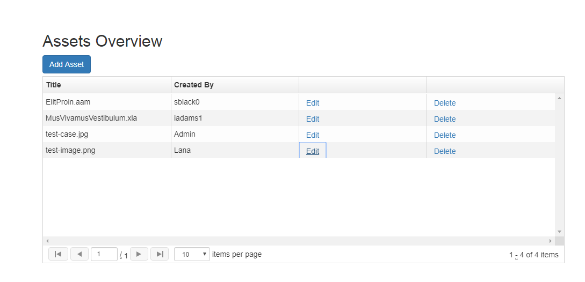

# Angular 1.6 + CRUD operations - sample app

This is a sample web app using Angular 1.6, Web API, Entity Framework and SQL Server LocalDB.

It allows to add/update text information about a file or delete it.

